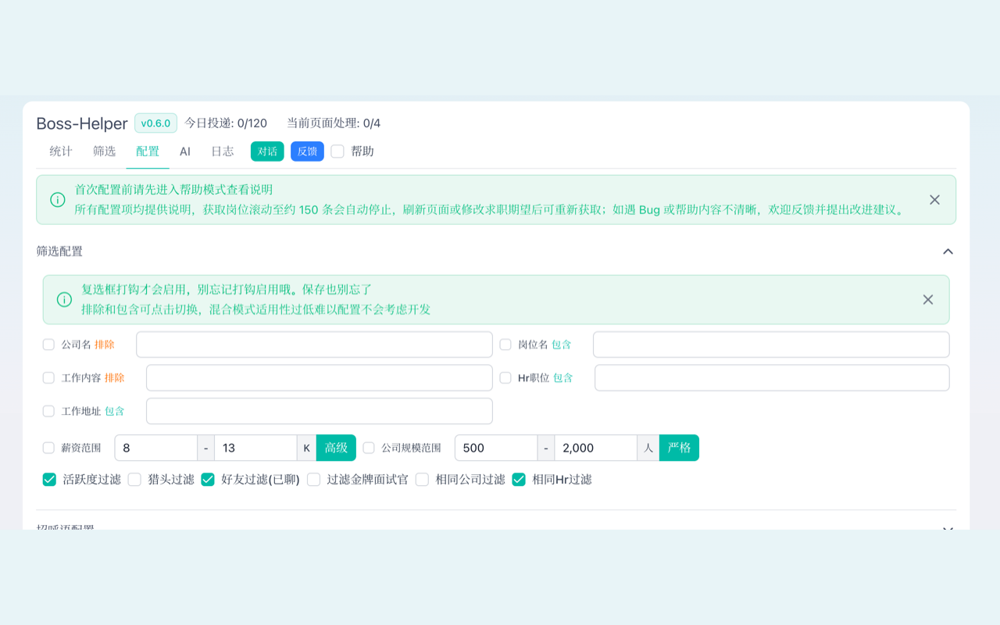
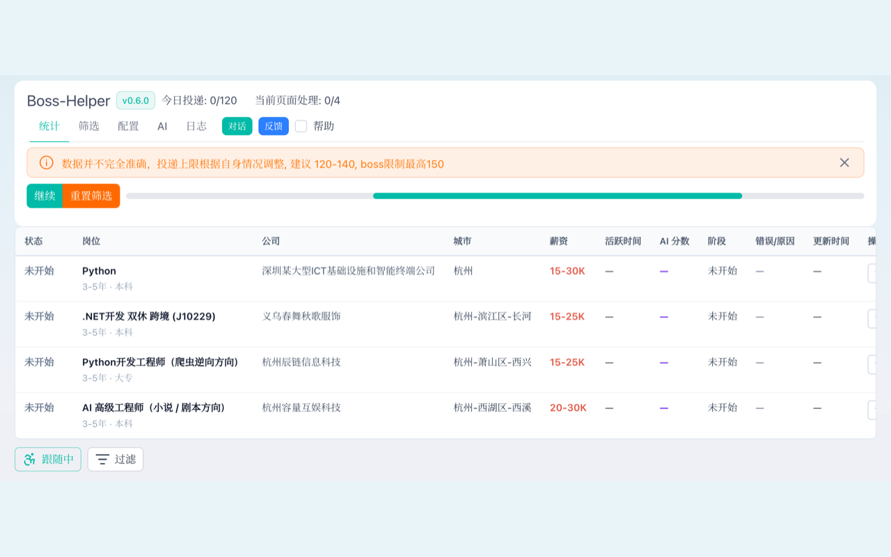
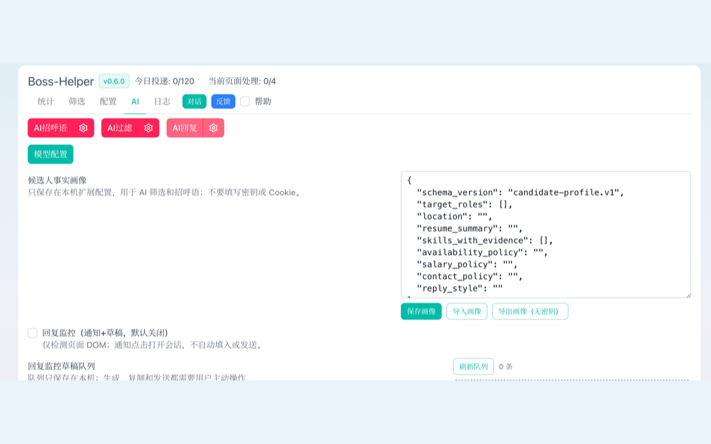
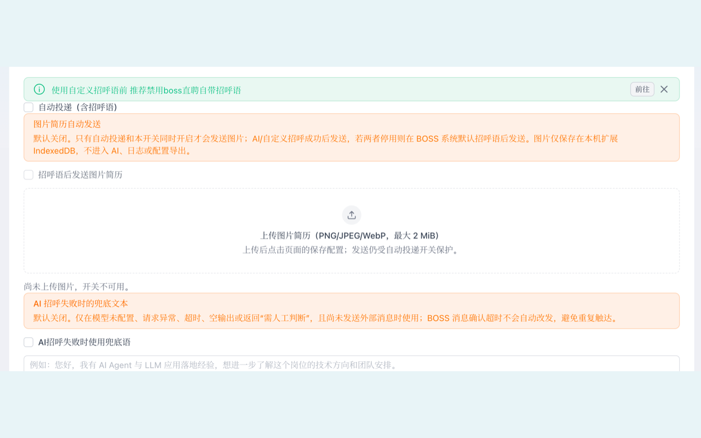
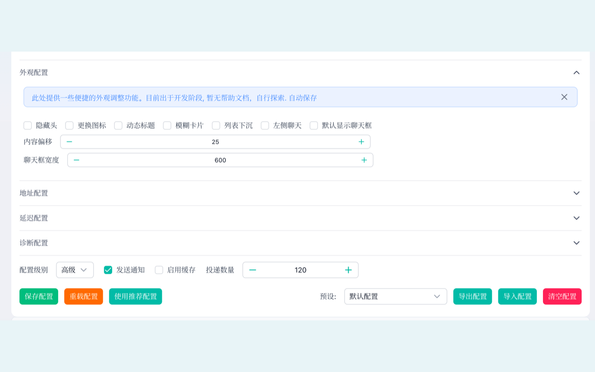

# BossHelper V2

> 面向 Boss直聘的求职辅助扩展：职位筛选、AI 招呼草稿、投递进度与人工确认工作流。

[](https://github.com/ump45nose/boss-helper-v2/releases)
[](https://developer.chrome.com/docs/extensions/develop/migrate/what-is-mv3)
[](LICENSE)

## 项目特点

BossHelper V2 把批量求职流程拆成可观察、可配置、可中止的步骤，重点保留用户对投递和沟通的最终控制权。

- **可组合的职位筛选**：按岗位、公司、薪资、规模、活跃度、已沟通状态、公司和招聘者等条件筛选；可定位并复用页面原生筛选控件。
- **投递安全边界**：自动投递默认关闭。只有用户显式开启后才会执行；岗位投递成功后才写入投递状态和公司/HR 去重记录，失败不会被误标成已投递。
- **可观测的批量流程**：提供进度、统计、日志和有界随机等待；仅在真实投递成功后计数，便于暂停、复核和继续处理。
- **AI 仅作辅助**：支持候选人事实画像、职位筛选和招呼语草稿。模型异常、超时、空输出、过长输出或“需人工判断”时停止，兜底招呼语也须由用户单独开启。
- **消息防重复**：聊天发送确认超时或失败时不自动重发；招呼语文本和图片分别在成功后写入状态，避免重连或重复任务造成重复触达。
- **本地优先的图片简历**：PNG/JPEG/WebP 图片简历最大 2 MiB，默认关闭；二进制只保存在本机 IndexedDB，不进入 AI 请求、日志、配置导出或发布包。
- **最小权限与脱敏日志**：仅申请 `storage` 与 `notifications`，不申请 `chrome.cookies`；站点权限限制为 `zhipin.com` 及子域，日志对密钥、Token、Cookie 和授权头强制脱敏。
- **稳定的页面生命周期**：采用独立 DOM/消息命名空间，路由切换时释放监听、观察器和聊天连接，可与其他扩展更安全地共存。

## 界面预览

从职位偏好到投递进度，所有关键状态都在一个界面中完成；自动化功能须由你主动开启，随时可以暂停或调整。

### 先确定哪些职位值得投

按岗位、薪资、公司规模、活跃度、已沟通记录和招聘者设置条件，减少重复沟通与无效浏览。

[](docs/store/screenshots/03-job-filtering.png)

### 全程看得见的投递进度

职位会按阶段展示处理状态、薪资、城市和原因。你可以在开始前复核筛选结果，并在处理中暂停或继续。

[](docs/store/screenshots/06-progress-dashboard.png)

### 用真实经历生成 AI 草稿

导入候选人事实画像后，AI 可辅助筛选和生成招呼语草稿。草稿需要你确认；信息不足、模型异常或结果不可靠时，流程会停止而不是替你发送。

[](docs/store/screenshots/04-ai-profile-and-drafts.png)

### 图片简历与失败保护，由你决定是否开启

图片简历、AI 失败兜底语均为独立开关且默认关闭。图片只保存在本机扩展存储中，不会进入 AI 请求、日志或配置导出。

[](docs/store/screenshots/02-resume-and-fallback.png)

### 让工作流适应你的习惯

可调整界面显示、地址、间隔、通知和处理上限；配置会自动保存，帮助你在不同求职节奏下保持可控操作。

[](docs/store/screenshots/01-appearance-settings.png)

## 使用边界

- 自动投递、AI 失败兜底语、图片简历发送和回复监控均为**默认关闭**的独立功能。
- AI 回复监控只生成待确认草稿和通知，不会自动填入或发送消息。
- 扩展不提供验证码绕过、指纹伪装、代理轮换、随机点击/滚动或自动交换联系方式等规避平台规则的能力。
- 使用前请核对筛选条件、投递数量、招呼语和 AI 服务配置，并遵守 Boss直聘及所使用 AI 服务的规则。

## 快速开始

### 从源码构建

建议先克隆完整仓库和子模块，再安装依赖：

```bash
git clone https://github.com/ump45nose/boss-helper-v2.git
cd boss-helper-v2
git submodule update --init --recursive
npm install --legacy-peer-deps
```

构建 Chrome Manifest V3 版本：

```bash
npm run check
npm run build:chrome
```

打开 `chrome://extensions`，开启“开发者模式”，选择“加载已解压的扩展程序”，并选取：

```text
output/chrome-mv3
```

### 打包上架

```bash
npm run zip:chrome
npm run smoke:v2
```

Chrome 商店上传文件为：

```text
output/boss-helper-v2-0.6.0-chrome.zip
```

该 ZIP 用于商店上传；本地安装请加载解压后的 `output/chrome-mv3`，不要直接加载压缩包。上架字段、隐私披露和图标说明见 [docs/CHROME_WEB_STORE.md](docs/CHROME_WEB_STORE.md)。

## 配置建议

1. 在“筛选”页先定义岗位、薪资、地点、公司规模与去重策略。
2. 在“配置”页设置投递上限、间隔和通知；确认无误后再显式开启自动投递。
3. 在“AI”页导入或编辑 [候选人画像示例](candidate-profile.example.json)。画像仅保存于扩展本地配置，请勿填写 Cookie、账号密码或 API Key。
4. 如启用自定义模型，请自行确认服务地址、密钥处理和数据发送范围；详情见 [隐私政策](PRIVACY.md)。

## 常用命令

| 命令                   | 用途                                               |
| ---------------------- | -------------------------------------------------- |
| `npm run dev`          | Chrome 开发模式                                    |
| `npm run check`        | Vue/TypeScript 类型检查                            |
| `npm run lint`         | 类型感知的静态检查                                 |
| `npm run fmt:check`    | 格式检查                                           |
| `npm run build:chrome` | 构建 Chrome MV3 解压目录                           |
| `npm run zip:chrome`   | 构建并生成 Chrome 商店 ZIP                         |
| `npm run smoke:v2`     | 校验产物、清单版本、无 `key`/`cookies` 和 ZIP 结构 |

## 项目结构

```text
src/entrypoints/     扩展页面、BOSS 页面集成与后台工作流
src/components/      Vue 界面与配置组件
src/composables/     筛选、投递、配置、模型和状态逻辑
src/message/         扩展内消息与请求代理
src/utils/           命名空间、日志脱敏和通用工具
public/              国际化资源与扩展图标
docs/store/          商店图标与 1280×800 截图素材
scripts/             构建产物冒烟校验
```

## 文档与反馈

- 项目主页：<https://github.com/ump45nose/boss-helper-v2>
- 问题反馈：<https://github.com/ump45nose/boss-helper-v2/issues>
- Windows 安装说明：[INSTALL-WINDOWS.md](INSTALL-WINDOWS.md)
- Chrome Web Store 上架资料：[docs/CHROME_WEB_STORE.md](docs/CHROME_WEB_STORE.md)
- 隐私政策：[PRIVACY.md](PRIVACY.md)

## 参与贡献

欢迎提交 Issue 和 Pull Request。修改后请至少执行：

```bash
npm run check
npm run build:chrome
npm run zip:chrome
npm run smoke:v2
```

## 许可证

本项目采用 [MIT License](LICENSE) 发布。
